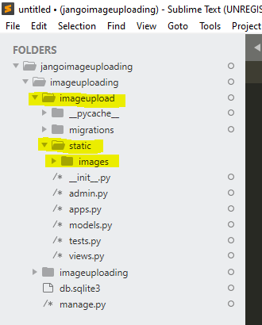

## Image File uploading in Django
In this we will learn how to implement image and file uploading with django
## Setup
Open the command line and navigate to which directory you want to create the project.
First,we need to install `pillow` which is a Python image process library Django relies on for image files.
For non-image file uploads, pillow is not needed. 
```
pip install pillow
```


### Project and App

Create your own Django project,new app and once run the server to make sure that the server is working fine or not.
In our case project name is `imageuploading` and the app name is `imageupload`.
```
F:\jango\jangoimageuploading>django-admin startproject imageuploading
F:\jango\jangoimageuploading>cd imageuploading
F:\jango\jangoimageuploading\imageuploading>python manage.py startapp imageupload
F:\jango\jangoimageuploading\imageuploading>python manage.py runserver
Watching for file changes with StatReloader
Performing system checks...

System check identified no issues (0 silenced).

You have 17 unapplied migration(s). Your project may not work properly until you apply the migrations for app(s): admin, auth, contenttypes, sessions.
Run 'python manage.py migrate' to apply them.
May 13, 2020 - 15:32:07
Django version 3.0.5, using settings 'imageuploading.settings'
Starting development server at http://127.0.0.1:8000/
Quit the server with CTRL-BREAK.
```
Since we have added a new app we need to tell the Django about it at the bottom of the `INSATLLED_APPS` configuration in `settings.py`.
```python
#imageuploading/settings.py
INSTALLED_APPS = [
    'django.contrib.admin',
    'django.contrib.auth',
    'django.contrib.contenttypes',
    'django.contrib.sessions',
    'django.contrib.messages',
    'django.contrib.staticfiles',
    'imageuploading', #new
]
```
## Models
Starting with the database model is a good choice.In our case our model `imageupload` has only two fields `Name` and `image`.
We'll also include a __str__ method below so that the Name  and image appears in our Django admin later on.
```python
#imageupload/models.py
from django.db import models

class imageupload(models.Model):
    Name = models.CharField(max_length=100)
    image = models.ImageField(upload_to='images/')

    def __str__(self):
        return self.Name+return self.image
  ```
The location of the uploaded image will be in `MEDIA_ROOT/images`. In Django, the `MEDIA_ROOT` setting is where we define the location of all user uploaded items. We'll set that now.

<p>If we want to use a regular file here the only difference could be to change <b>ImageField</b> to <b>FileField</b>.</p>

### MEDIA_ROOT

Open up `imageuploading/settings.py` in your text editor. We will add two new configurations. By default MEDIA_URL and MEDIA_ROOT are empty and not displayed so we need to configure them:

<ul>
<li>MEDIA_ROOT is the absolute filesystem path to the directory for user-uploaded files</li>
<li> MEDIA_URL is the URL we can use in our templates for the files</li>
</ul>

Now letus store all images in the `static` folder.For that create a static folder inside our app.After that create an `images` folder inside static folder


    


