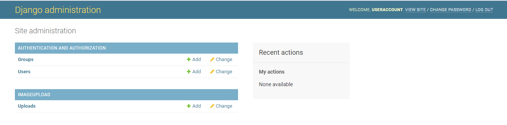
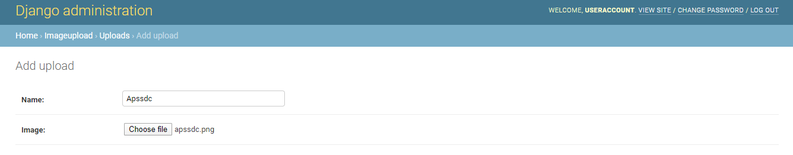
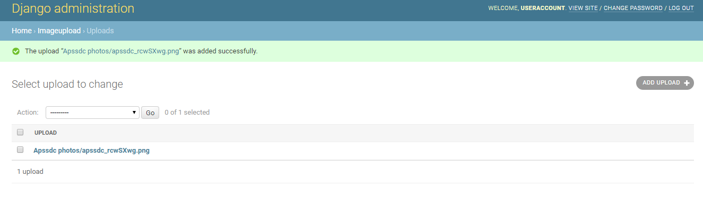
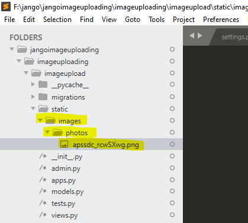
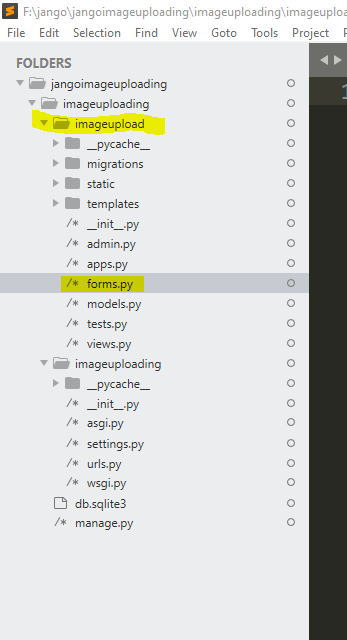
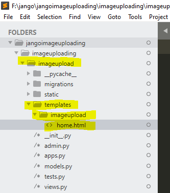
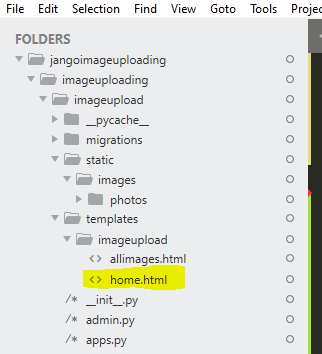
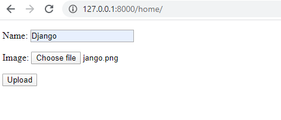
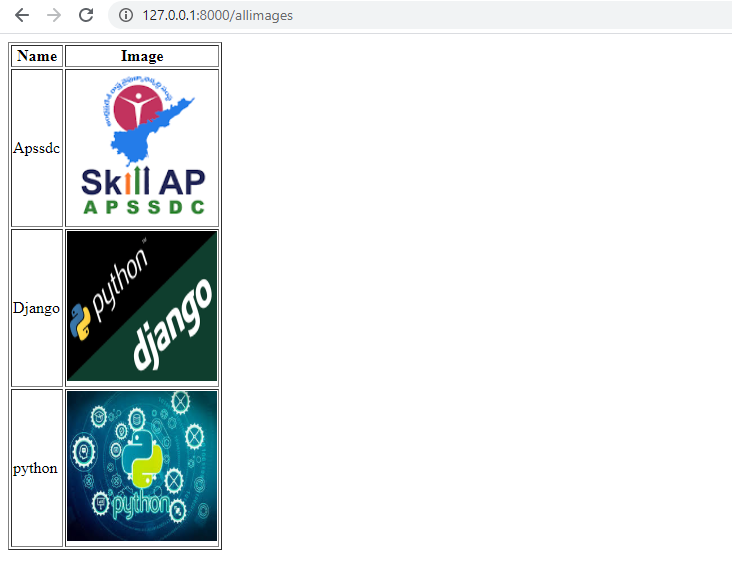

## Image File uploading in Django
In this we will learn how to implement image file uploading with django
## Setup
Open the command line and navigate to which directory you want to create the project.
First,we need to install `pillow` which is a Python image process library Django relies on for image files.
For non-image file uploads, pillow is not needed. 
```
pip install pillow
```


### Project and App

Create your own Django project,new app and once run the server to make sure that the server is working fine or not.
In our case project name is `imageuploading` and the app name is `imageupload`.
```
F:\jango\jangoimageuploading>django-admin startproject imageuploading
F:\jango\jangoimageuploading>cd imageuploading
F:\jango\jangoimageuploading\imageuploading>python manage.py startapp imageupload
F:\jango\jangoimageuploading\imageuploading>python manage.py runserver
Watching for file changes with StatReloader
Performing system checks...

System check identified no issues (0 silenced).

You have 17 unapplied migration(s). Your project may not work properly until you apply the migrations for app(s): admin, auth, contenttypes, sessions.
Run 'python manage.py migrate' to apply them.
May 13, 2020 - 15:32:07
Django version 3.0.5, using settings 'imageuploading.settings'
Starting development server at http://127.0.0.1:8000/
Quit the server with CTRL-BREAK.
```
Since we have added a new app we need to tell the Django about it at the bottom of the `INSATLLED_APPS` configuration in `settings.py`.
```python
#imageuploading/settings.py
INSTALLED_APPS = [
    'django.contrib.admin',
    'django.contrib.auth',
    'django.contrib.contenttypes',
    'django.contrib.sessions',
    'django.contrib.messages',
    'django.contrib.staticfiles',
    'imageuploading', #new
]
```
## Models
Starting with the database model is a good choice.In our case our model `imageupload` has only two fields `Name` and `image`.
We'll also include a __str__ method below so that the Name  and image appears in our Django admin later on.
```python
#imageupload/models.py
from django.db import models

class upload(models.Model):
    Name = models.CharField(max_length=100)
    image = models.ImageField(upload_to='images/')

    def __str__(self):
        return self.Name+" "+str(self.image)
  ```
The location of the uploaded image will be in `MEDIA_ROOT/images`. In Django, the `MEDIA_ROOT` setting is where we define the location of all user uploaded items. We'll set that now.

<p>If we want to use a regular file here the only difference could be to change <b>ImageField</b> to <b>FileField</b>.</p>

### MEDIA_ROOT

Open up `imageuploading/settings.py` in your text editor. We will add two new configurations. By default MEDIA_URL and MEDIA_ROOT are empty and not displayed so we need to configure them:

<ul>
<li>MEDIA_ROOT is the absolute filesystem path to the directory for user-uploaded files</li>
<li> MEDIA_URL is the URL we can use in our templates for the files</li>
</ul>

Now letus store all images in the `static` folder.For that create a static folder inside our app.After that create an `images` folder inside static folder


Now let us add the `MEDIA_ROOT` and `MEDIA_URL` to our settings.py
```python
#imageuploading/settings.py
MEDIA_ROOT=os.path.join(BASE_DIR,'imageupload/static/images')

MEDIA_URL='/photos/'
```
In MEDIA_ROOT we are giving our filepath i,e `imageupload/static/images ` all useruploaded files will configure to this path.
In MEDIA_URL we have given `photos` i,e all the user uploaded files will be created under the photos which creates in the `images` folder that you will see later on.

## Admin
Now update the `imageupload/admin.py` file so that we can see our `imageupload` app in the Django admin.
```python
#imageupload/admin.py
from django.contrib import admin


from imageupload.models import upload
admin.site.register(upload)
```
Generate a new migrations file  and migrate to upadte the database by running the following commands in the cmd
```
F:\jango\jangoimageuploading\imageuploading>python manage.py makemigrations
Migrations for 'imageupload':
  imageupload\migrations\0001_initial.py
    - Create model upload
```
```
F:\jango\jangoimageuploading\imageuploading>python manage.py migrate
Operations to perform:
  Apply all migrations: admin, auth, contenttypes, imageupload, sessions
Running migrations:
  Applying contenttypes.0001_initial... OK
  Applying auth.0001_initial... OK
  Applying admin.0001_initial... OK
```
Now we can create a superuser account to access the admin and then execute runserver to spin up the local web server
```
python manage.py createsuperuser
python mangage.py runserver
```
If you go to http://127.0.0.1:8000/admin you'll be able to log in to the Django admin site. It should redirect you to this page:



Click on the "+ Add" link next to Uploads. You can download and add whatever you like


Upon "Save" you will be redirected to the Uploads page where we can see all our image upolads.



If you look within the local media folder in your project you'll see under images there is now the apssdc_rcwSXwg.png image file under photos that was what MEDIA_URL would do.



Ok, so at this point we're done with the basics. But let's take it a step further and display our imageupload which means urls.py, views.py, and template files.

## URLS
We'll need two urls.py file updates. First at the project-level `imageuploading/urls.py` files we need to add imports for settings and static and views.Then define a route for the `imageupload` app. Note,we also need to add the `MEDIA_URL` if settings are in DEBUG mode, otherwise we won't be able to view uploaded images locally.

```python
#imageuploading/urls.py

from django.contrib import admin
from django.urls import path
from django.conf import settings #new
from django.conf.urls.static import static #new
from imageupload import views #new

urlpatterns = [
    path('admin/', admin.site.urls),
    path('home/', views.home,name="home"), #new
]

if settings.DEBUG: #new
    urlpatterns += static(settings.MEDIA_URL, document_root=settings.MEDIA_ROOT)
```
## Forms
Now we can add a form so regular users, who wouldn't have access to the admin, can also upload photos.We can extend Django's built-in ModelForm in `forms.py` or we can create our own html form in templates
Let us proceed using Django's built-in ModelForm.Create a newfile within the app `imageupload/forms.py` and create a Modelform by importing the model that you have created.



```python
#imageupload/forms.py
from django.forms import ModelForm
from imageupload.models import upload
class uploadform(ModelForm):
	class Meta:
		model=uploadform
		fields='__all__'
```
## Views
create a `home` view that uses the model and and templates

```python
from django.shortcuts import render
from django.http import HttpResponse #new
from imageupload.forms import uploadform #new
from imageupload.models import upload #new

def home(request):
	if request.method=="POST":
		form=uploadform(request.POST,request.FILES) #uploading data given by the user in home page to database
		if form.is_valid():
			form.save()

		data=upload.objects.all() #retreving all the data from the database
			
		return render(request,'imageupload/allimages.html',{'data':data}) #sending all the retrived data to allimages.html
	form=uploadform() 
	return render(request,'imageupload/home.html',{'form':form})
 ```
 ## Templates
 Here we used two templates in order to upload the file `home.html`and view all the images `allimages` that we have uploaded
 Now create a template `home.html`, within the app `imageupload/templates/imageupload/home.html` and and write the htmlcode
 
 
 
```html

<!DOCTYPE html>
<html>
<head>
	<title>Home</title>
</head>
<body>
	<form action="" method="POST" enctype="multipart/form-data" >
		
		{{ form.as_p }}
		<button type="submit"> Upload</button>
		
	</form>
</body>
</html>

```
Also create a template `allimages.html` and write down the htmlcode



```html
<!DOCTYPE html>
<html>
<head>
	<title>Allimages</title>
</head>
<body>
<table border="1">
	<thead>
		<tr>
			<th>Name</th>
			<th>Image</th>
		</tr>

	</thead>
	<tbody>
	
	<tr>
	<td> {{row.Name}} </td>
    <td></td>
    </tr>

</tbody>
</table>
</body>
</html>
```
Ok, that's it! Make sure the server is running with the python manage.py runserver command and navigate to our homepage at http://127.0.0.1:8000/home. Refresh the page if needed.



After giving the details,click on upload.You will be redirected to the allimages.html which you can see all the image that you have uploaded




